# RUKY GYMASTIC

The objective of this application is to represent a gym. It will allow users to store important information related to activities carried out in the gym.

___

## MEMBERS OF THE TEAM

| Name | Corporative email | Github user |
| - | - | - |
| Carlos Fernández López | c.fernandezl.2019@alumnos.urjc.es | ruky00 |
| Néstor Granado Pérez | n.granado.2019@alumnos.urjc.es | nestorgranado |
| Alessandro Nuzzi Herrero | a.nuzzi.2019@alumnos.urjc.es | AlessandroNuzziURJC |
| Andrea Nuzzi Herrero | a.nuzzi.2018@alumnos.urjc.es | AndyNuzzi |
| Fernando Sarabia Rodríguez | f.sarabia.2019@alumnos.urjc.es | f.sarabia |

___

## CORPORATIVE TOOLS

In order to plan the distribution of work, the team is going to use trello, (https://trello.com/b/u60sMfLS/g3-daw-2021-22). If online meetings are necessary, the team will use Discord.

___

## PHASE 0: APLICATION FUNCTIONALITIES

### ENTITIES

There are going to be four different entities:
* **USER** —  This entity represents the application's users. There are different types of users that take part in the system:
  * Gym Member
  * Gym Instructor
  * Administrator 
*  **EXERCISE** — This entity represents a physical activity a gym member can perform. The member can be guided by an instructor or not.
*  **GROUP ACTIVITIES** — This entity represents a sport which is directed by instructors. Group activities can be created, modified or deleted by the administrator.
*   **EXERCISE TABLES** — This entity is formed by different types of exercises. The exercise tables are for gym members. Exercise tables can be created, modified or deleted by gym instructors.
  
### USERS

Among the user entity there are going to be different types of users:
* **Member** — is the type of user that have access to the different services provided by the gym.
* **Instructor** — this type of user can assign exercise tables to members and book rooms to perform group activities.
* **Administrator** — its main activity is to create and maintain updated the gym information.
* **Unregistered user** — this type of user can only access to information about the different prices and services provided by the gym.

### USER PERMISSIONS

Members and Instructors own the information they have in their profile. They can edit, create, modify and delete the information:
* Profile avatar
* Email
* Password
* Change of password
* Percentage of corporal fat
* Height
* Breadth
* Gender
* Bank account associated

Permissions associated to the administrator are: 
* Register new group activities, modify the existing ones and delete activities.
* Register new instructors, edit the instructors that form part of the gym and delete instructors.
* See the general progress of the gym members.

### IMAGES

Members and instructors will have representative avatars. They can modify it.
Administrators can edit images associated to the different entities: activities, exercise tables, general information of the gym...

### GRAPHICS

The administrator is the one who has de capability of visualizing the different graphics. They are mainly related to member participation graphics:
* Activities (it will be shown as bar charts)
* Exercise Tables (it will be shown as bar charts)

### COMPLEMENTARY TECHNOLOGY

Introduce the localization of the gym using Google Maps.
Generate different pdfs with the exercise tables.

### ADVANCED CONSULTING ALGORITHM

At the end of a season, members will be able to see their individual progress.

___

## Phase 1: Layout of pages

In order to help clarifying the references to the amount of screens that conform the web application, the team has used some codes:
* USRADM_XX: Screens that are dedicated for the administrator.
* USRMEM_XX: Screens that are dedicated for the members of the gym.
* USRMON_XX: Screens that are dedicated for the monitors of the gym.
* USRNR_XX: Screens that are dedicated for the unregistered users.

### Screens

The application consists of the following screens:

* USRADM_01Statistics: This page shows the different statistics the administrator is able to see.
  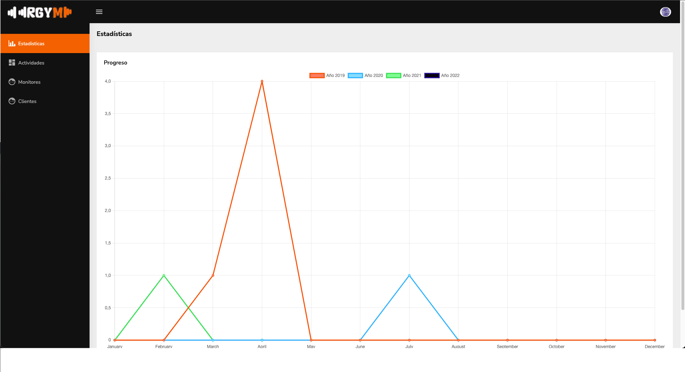
* USRADM_02ActivitiesList: This screen shows the different grupal activities that are registered in the system.
  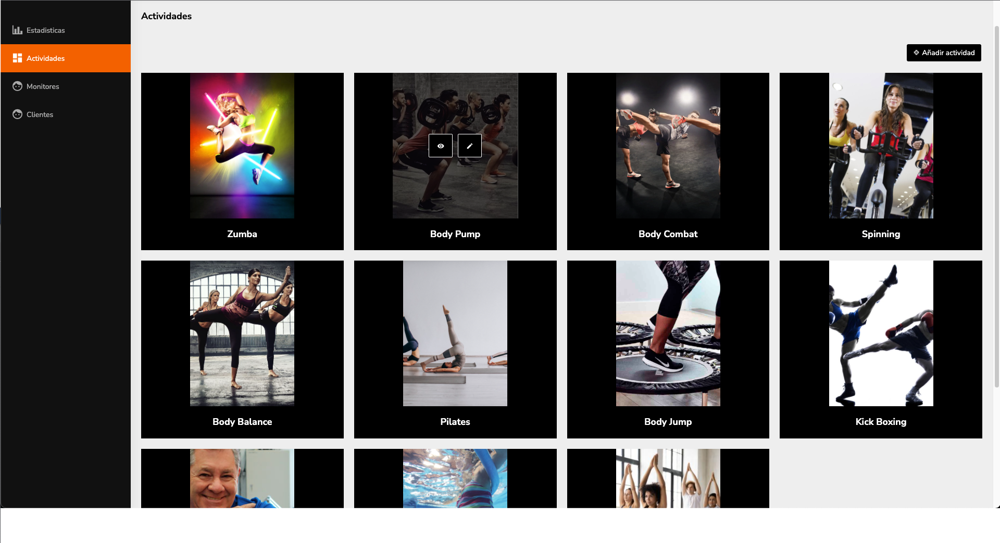
* USRADM_03MonitorsList: This screen contains a list of monitors that are working for the gym.
  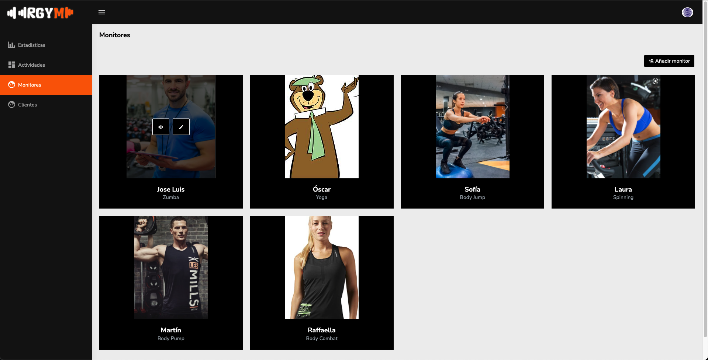
* USRADM_04AddActivity: This screen is a form. On it, you can add the information needed for creating a new activity.
  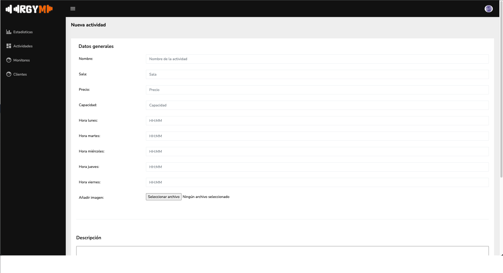
* USRADM_05DeleteActivity: This screen shows all the activities and allows the administrator to select several activities to delete them.
  
* USRADM_06SeeActivityInfo: This screen shows the information of an activity.
  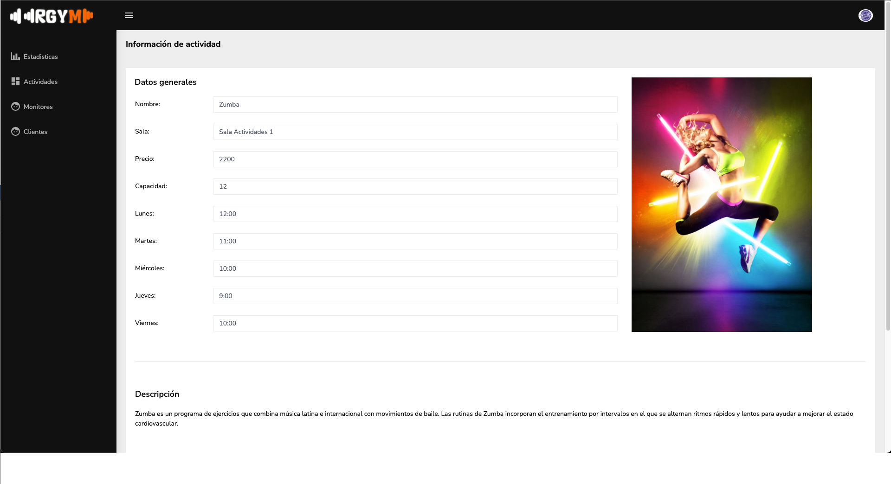
* USRADM_07EditActivity: This screen allows the administrator to change the information of an specific activities.
  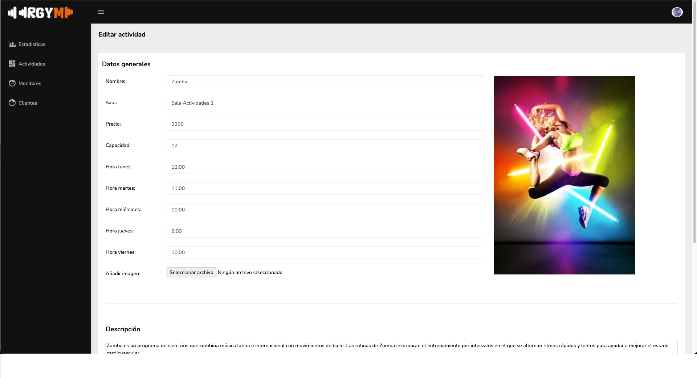
* USRADM_08AddMonitor: This screen allows the admin to add a new monitor to the system.
  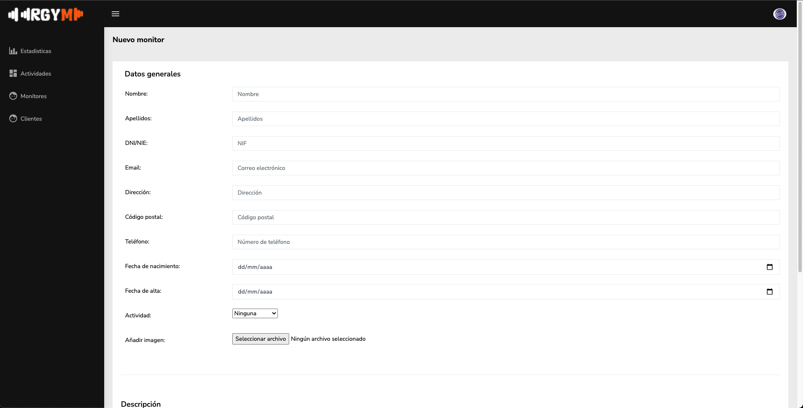
* USRADM_09DeleteMonitor: This screen shows a table with monitors. The administrator can select them and delete them from the system.
  
* USRADM_10SeeMonitorInfo: This screen shows the information about an specific monitor.
  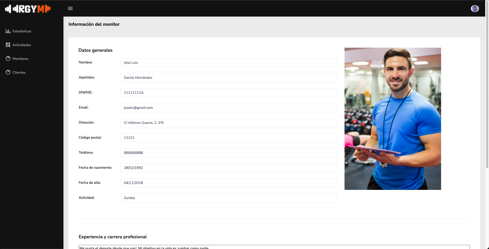
* USRADM_11EditMonitor: The administrator can edit the amount of instructors the gym has. The administrator can add a new instructor or delete an existing instructor.
  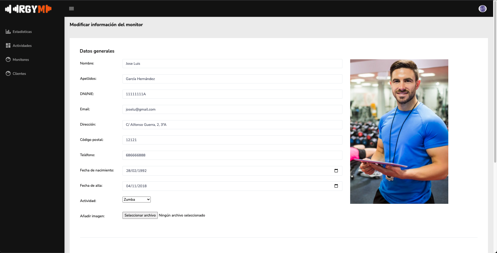
* USRADM_12EditMembers: The administrator can edit the amount of members the gym has. The administrator can add a new member or delete an existing member.
  
* USRMEM_01ExerciseTable: The user can see the different exercise tables associated by the instructor.
  
* USRMEM_02Profile: The member can see the information used in the register.
  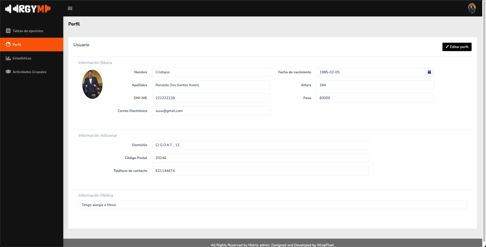
* USRMEM_03EditProfile: Members can edit their private information.
  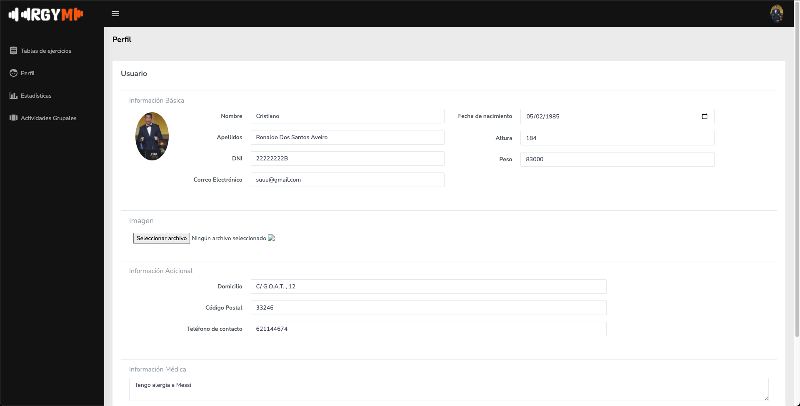
* USRMEM_03Statistics: User can see their progress along the season. This progress is going to be shown as different charts.
  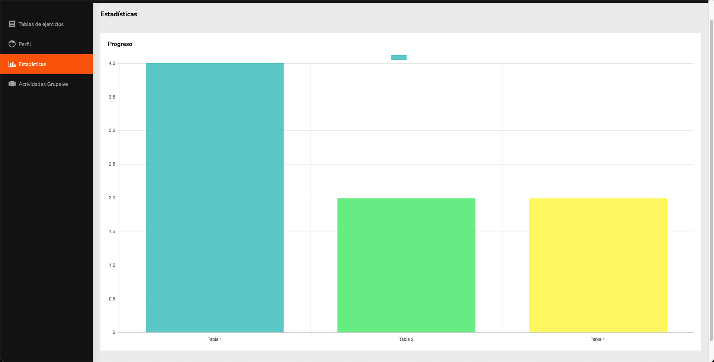
* USRMEM_04Activities: The member can see the activities they are subscribed.
  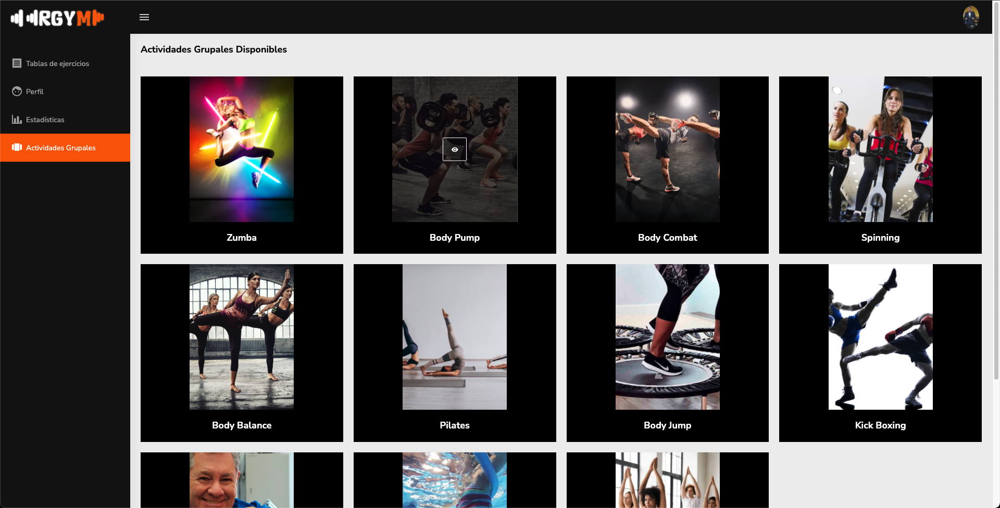
* USRMON_01Schedule: This page shows monitor schedule.
  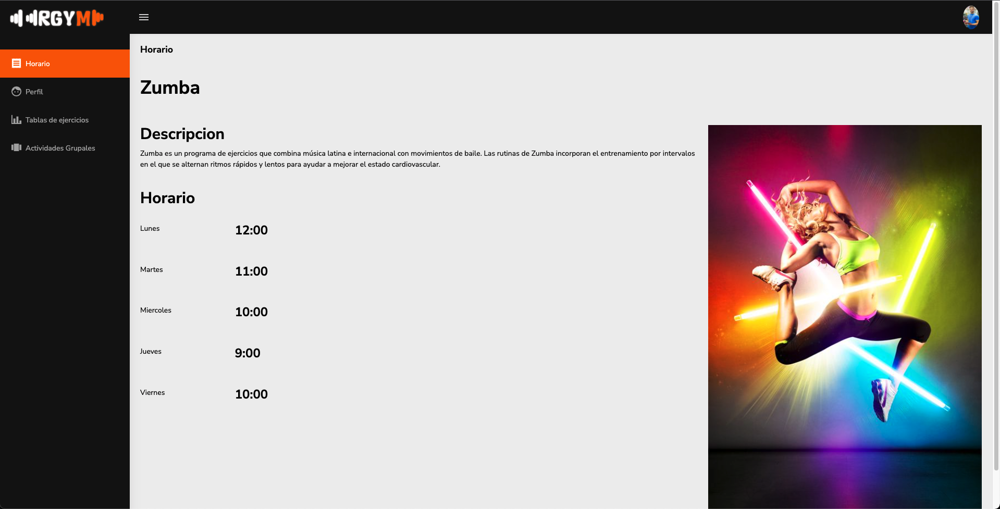
* USRMON_02Profile: The monitor can see the information used in the register.
  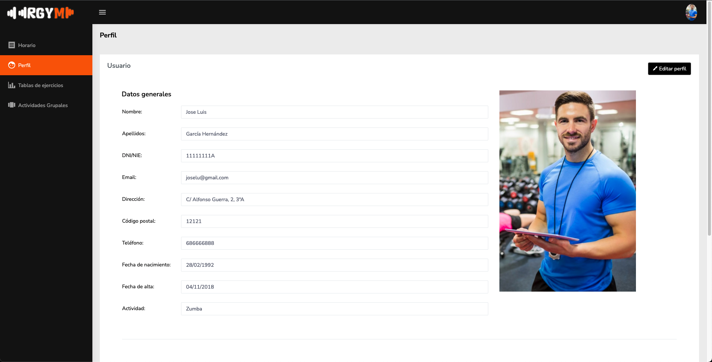
* USRMON_03ExerciseTable: This page shows the activities the monitor will teach.
  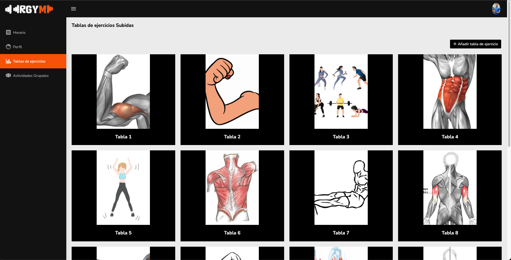
* USRMON_04GrupalActivities: This page show the exercises tables the monitor uploads. Exercices tables can be uploaded and deleted.
  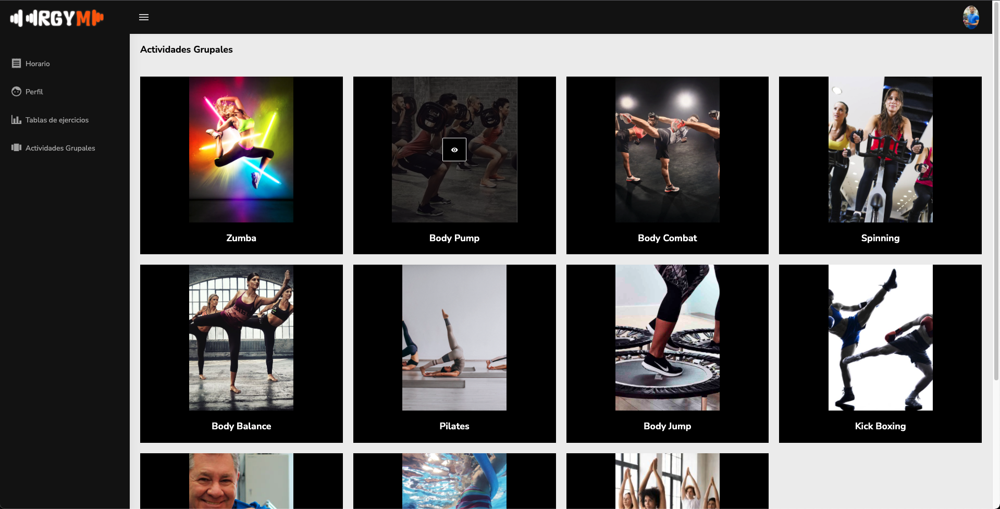
* USRMON_05EditProfile: Monitors can edit their private information.
  
* USRMON_06AddExerciseTable: This screen allows the monitor to add a new exercise table to the system.
  
* USRMON_07DeleteExerciseTable: This screen shows a table with exercises tables. The monitor can select them and delete them from the system.
  
* USRNR_01GymMainPage: Main page that all users will see upon entering and briefly explains the gym's services.
  
* USRNR_02Schedule: This page shows the schedule of activities available in the gym.
  
* USRNR_03ContactUsGym: Page with contact information of the gym as well as a map with the location of the gym.
  
* USRNR_04PricesGym: This page shows the three possible rates you can choose to join the gym.
  
* USRNR_05activitiesGym: This page has two parts, one contains the individual activities offered by the gym and the other the group activities.
  
* USRNR_06SignInGym: Gym registration page.
  
* USRNR_07LogInGym: Page used by regsitrated users to enter to their account in the gym.
  

### Navigation diagram

The following diagram shows how users can navigate through the different pages of the application according to their role.
  

___

## PHASE 2: WEB WITH HTML GENERATED IN SERVER AND AJAX

### EXECUTION INSTRUCTIONS

#### VERSIONS

The different technologies used among this phase are the following:
  * Java: 17.0.2
  * Maven: 4.0.0 
  * Spring Boot: 2.6.3
  * Itextpdf: 5.5.13.3
  * Postgres: 14.2
  * PgAdmin: 4v6.6

#### INSTALL POSTGRES

In order to install the data base, the following steps are needed:
  * The first thing needed is install docker desktop: https://www.docker.com/get-started
  * Open shell and introduce: 
  		* windows/mac: docker run --rm -e POSTGRES_PASSWORD=password -e POSTGRES_DB=posts -p 5432:5432 -d postgres:14.2
  		* ubuntu 20.4: sudo apt install postgresql postgresql-contrib

#### INSTALL PGAdMIN

In order to use PGAdmin, it needs to be installed: https://www.pgadmin.org/download/

#### CONFIGURE POSTGRES WITH PGADMIN

By the time PGAdmin is downloaded, in the directory tree press "Servers" with the right button. Then choose "register" option and then "Server" option.

Right after that, among the diferent pages of the configuration of the server, we have changed:
  * Name -- Local
  * Host -- localhost
  * Password -- password

#### PROYECT DOWNLOAD

In order to get our code, you have to enter to github https://github.com/CodeURJC-DAW-2021-22/webapp3, press code button and download zip.

#### ERROR

There have been some problems with Maven dependencies in pom.xml file. The problems are related with the complementary technology of creating pdfs, you have to enter to pom.xml file and remove the dependency *itextpdf*. Right after that you have to reload the file, and put the dependency back. Then you will have to reload the pom again.

#### PROYECT EXECUTION

The IDE used to program this application is IntelliJ. In order to run the application you have to presh the button run located on the IDE and make sure you are located in *backend* directory. 
Then you have to open a browser, all the members of the team have used Google Chrome, so we recommend that browser. 
To see the application you have to type on the search bar *https://localhost:8443/USR_mainpage*. That is the main page of the application.

### DATA BASE ENTITIES DIAGRAM

### CLASSES AND TEMPLATES DIAGRAM

### MEMBERS PARTICIPATION

#### Nestor Granado Perez

##### DESCRIPTION OF TASKS

I have worked on the functionalities of non-registered users, I have carried out the implementation and management with the rest of the parts of spring security and ultimately I have helped to correct errors

##### COMMITS DONE

| Name | Description |
| - | - |
| 1 | Pages security, add log in and sign in actions and registered mode (https://github.com/CodeURJC-DAW-2021-22/webapp3/commit/e27f6fda844e03f079614b0769ee2cf635d16c0b) |
| 2 | Client security and update files (https://github.com/CodeURJC-DAW-2021-22/webapp3/commit/f6f1026f28356ffe65b9fb8bc3d66dca1508e091) |
| 3 | Web security version 1: Security structure,login error page and private and public pages control(https://github.com/CodeURJC-DAW-2021-22/webapp3/commit/798ed523c55ef53cb34f1cfdf733196013a90363) |
| 4 | Test DDBB link, add image files to main page and activity page, update files(https://github.com/CodeURJC-DAW-2021-22/webapp3/commit/fc790210cc2484824e8ddc8261e4655ca2ae4e34) |
| 5 | update error files (https://github.com/CodeURJC-DAW-2021-22/webapp3/commit/8af07a2fcc8617150e02f873512074f6b10518fd) |

##### FILES PARTICIPATED

| File name | Link to github |
| - | - |
| 1 | NonRegController.java (https://github.com/CodeURJC-DAW-2021-22/webapp3/blob/A-N-S-merge/backend/src/main/java/webapp3/webapp3/controller/NonRegController.java) |
| 2 | SecurityConfiguration.java (https://github.com/CodeURJC-DAW-2021-22/webapp3/blob/A-N-S-merge/backend/src/main/java/webapp3/webapp3/security/SecurityConfiguration.java) |
| 3 | USR_01mainPage.html(https://github.com/CodeURJC-DAW-2021-22/webapp3/blob/A-N-S-merge/backend/src/main/resources/templates/USR_01mainPage.html) |
| 4 | USR_03schedule.html(https://github.com/CodeURJC-DAW-2021-22/webapp3/blob/A-N-S-merge/backend/src/main/resources/templates/USR_03schedule.html) |
| 5 | USR_07sign_in.html(https://github.com/CodeURJC-DAW-2021-22/webapp3/blob/A-N-S-merge/backend/src/main/resources/templates/USR_07sign_in.html) |

#### Fernando Sarabia Rodriguez

##### DESCRIPTION OF TASKS

I have worked in the monitors funcionality, introducing Mustache to the pages associated to the monitors of the gym and introducing this functionality to the monitor controller. I have also created headers and footers related to monitors. I have helped migrating H2 to PostgreSQL. And I have also helped fixing several errors.

##### COMMITS DONE

| Name | Description |
| - | - |
| 1 | Adding Exercise table page and see exercise table info page. (https://github.com/CodeURJC-DAW-2021-22/webapp3/commit/486d10a498b73277bc5890eda37a7b6459b8101c) |
| 2 | Adding Grupal activities page and see activities info page. (https://github.com/CodeURJC-DAW-2021-22/webapp3/commit/3a3d9fc2a3e66e63fdd2baf031599584b3902a17) |
| 3 | Adding Profile and edit profile for monitors.(https://github.com/CodeURJC-DAW-2021-22/webapp3/commit/ff289067d8fc827566c45adc304afdd8e54aca7f) |
| 4 | Adding Grupal activities schedule for monitors (https://github.com/CodeURJC-DAW-2021-22/webapp3/commit/51c817c70bcae4fedcac91db143c1215717b96ff) |
| 5 | Adding header, footer and monitor controller(https://github.com/CodeURJC-DAW-2021-22/webapp3/commit/54855ab48f370926dcf42b04f158cee6701cf9f9) |

##### FILES PARTICIPATED

| File name | Link to github |
| - | - |
| 1 | MonitorController.java (https://github.com/CodeURJC-DAW-2021-22/webapp3/blob/A-N-S-merge/backend/src/main/java/webapp3/webapp3/controller/MonitorController.java) |
| 2 | USRMON_01Schedule.html (https://github.com/CodeURJC-DAW-2021-22/webapp3/blob/A-N-S-merge/backend/src/main/resources/templates/USRMON_01Schedule.html) |
| 3 | USRMON_04GrupalActivities.html (https://github.com/CodeURJC-DAW-2021-22/webapp3/blob/A-N-S-merge/backend/src/main/resources/templates/USRMON_04GrupalActivities.html) |
| 4 | USRMON_02Pofile.html (https://github.com/CodeURJC-DAW-2021-22/webapp3/blob/A-N-S-merge/backend/src/main/resources/templates/USRMON_02Pofile.html) |
| 5 | USRMON_05EditProfile.html (https://github.com/CodeURJC-DAW-2021-22/webapp3/blob/A-N-S-merge/backend/src/main/resources/templates/USRMON_05EditProfile.html) |

#### Alessandro Nuzzi Herrero

##### DESCRIPTION OF TASKS

My part was to create administrator functionality, adapt the DataBase to the system requirements, migrate from H2 database to PostgreSQL, fix monitors' pages, fix members' profile and edit profile, develop statistics for the administrator and for members (advanced consulting algorithm) and add images and some data to data base.

##### COMMITS DONE
| Name | Description |
| - | - |
| 1 | AdministratorController class' development (https://github.com/CodeURJC-DAW-2021-22/webapp3/commit/8c8c595c2fc519c0c7c44bd3a9fd5b6b5b69f3dc) |
| 2 | Adapting html templates to data model (https://github.com/CodeURJC-DAW-2021-22/webapp3/commit/e09edbb1043c94808fec3c8b0705bfef91e6b949) |
| 3 | Add some data to DataBase (https://github.com/CodeURJC-DAW-2021-22/webapp3/commit/c30d9967c7c3a7857a2ca5f09042d3586fa1e8b9) |
| 4 | Statistics added (https://github.com/CodeURJC-DAW-2021-22/webapp3/commit/ca343586c22a9f45b7a3f91356d403f555225d96) |
| 5 | Advanced algorithm (https://github.com/CodeURJC-DAW-2021-22/webapp3/commit/13702eae010f34628c9239310c94e09f0d220698) |

##### FILES PARTICIPATED
| File name | Link |
| - | - |
| 1 | AdminController.java (https://github.com/CodeURJC-DAW-2021-22/webapp3/blob/A-N-S-merge/backend/src/main/java/webapp3/webapp3/controller/AdminController.java) |
| 2 | USRADM_03MonitorsList.html (https://github.com/CodeURJC-DAW-2021-22/webapp3/blob/A-N-S-merge/backend/src/main/resources/templates/USRADM_03MonitorsList.html) |
| 3 | DataSampleService.java (https://github.com/CodeURJC-DAW-2021-22/webapp3/blob/A-N-S-merge/backend/src/main/java/webapp3/webapp3/service/DataSampleService.java) |
| 4 | UserAdminStatistics.html (https://github.com/CodeURJC-DAW-2021-22/webapp3/blob/A-N-S-merge/backend/src/main/resources/templates/USRADM_01Statistics.html) |
| 5 | UserTableService.java (https://github.com/CodeURJC-DAW-2021-22/webapp3/blob/A-N-S-merge/backend/src/main/java/webapp3/webapp3/service/UserExerciseTableService.java) |
#### Andrea Nuzzi Herrero

##### DESCRIPTION OF TASKS

I have worked in introducing Moustache to the pages associated to the members of the gym. I have also worked in the respective controllers and creating headers and footers related to members, administrators and monitors functionality. I have created the complementary technology that consists of downloading pdfs with the exercise tables. And I have also created ajax associated to the pages of the exercise tables and clients in administrator pages.

##### COMMITS DONE

| Name | Description |
| - | - |
| 1 | Adding pdfs to exercise table page with postgres data base (https://github.com/CodeURJC-DAW-2021-22/webapp3/commit/0e66a4d9631374fac32cae19e3c6f43098a4f228) |
| 2 | Adding AJAX to exercise tables members (https://github.com/CodeURJC-DAW-2021-22/webapp3/commit/3eb2727900c86744ac75cc6a38fa740e7fe9cf8a) |
| 3 |Adding AJAX to administrator client pages(https://github.com/CodeURJC-DAW-2021-22/webapp3/commit/c671a4f0e66077ed0187d4b4ef6c0cd7f9d1d0c5) |
| 4 | Refactoring header member (https://github.com/CodeURJC-DAW-2021-22/webapp3/commit/d97e86509fdd9575b2bae3ac8264297841647ba8) |
| 5 | Adding memberController (https://github.com/CodeURJC-DAW-2021-22/webapp3/commit/76a633153595c15dcbe62c164bc8c69e9d40bfbd) |

##### FILES PARTICIPATED

| File name | Link to github |
| - | - |
| 1 | AdminController.java (https://github.com/CodeURJC-DAW-2021-22/webapp3/blob/A-N-S-merge/backend/src/main/java/webapp3/webapp3/controller/AdminController.java) |
| 2 | MemberController.java (https://github.com/CodeURJC-DAW-2021-22/webapp3/blob/A-N-S-merge/backend/src/main/java/webapp3/webapp3/controller/MemberController.java) |
| 3 | USRMEM_header.html(https://github.com/CodeURJC-DAW-2021-22/webapp3/blob/A-N-S-merge/backend/src/main/resources/templates/USRMEM_header.html) |
| 4 | USRADM_12Clients.html(https://github.com/CodeURJC-DAW-2021-22/webapp3/blob/A-N-S-merge/backend/src/main/resources/templates/USRADM_12Clients.html) |
| 5 | ExerciseTableService.java (https://github.com/CodeURJC-DAW-2021-22/webapp3/blob/A-N-S-merge/backend/src/main/java/webapp3/webapp3/service/ExerciseTableService.java) |

#### Carlos Fernandez Lopez

##### DESCRIPTION OF TASKS

I have worked on data base creation and implementantion. I  have carried out the insertion of data too, such as exercises, exercise tables and grupal activities. Furthermore I did the HTML for adding and deleting activities.

##### COMMITS DONE

| Name | Description |
| - | - |
| 1 | Repositories, DataBaseInitializer and services (https://github.com/CodeURJC-DAW-2021-22/webapp3/commit/5f559634fd1f76b37d2fe2a876f8f528d3946092) |
| 2 | ServicesII (https://github.com/CodeURJC-DAW-2021-22/webapp3/commit/edde6e31b502afbb6ed6d55ea082122f340a509c) |
| 3 | Relations(https://github.com/CodeURJC-DAW-2021-22/webapp3/commit/02c1b2df6bf877ff982bc46515fd35d8cb13d1c5) |
| 4 |HTML for Adding and Deleting Activities.(https://github.com/CodeURJC-DAW-2021-22/webapp3/commit/7b5b517d79b5486ef9c34cb532289566cd45c828) |
| 5 | ExerciseTable Entity (https://github.com/CodeURJC-DAW-2021-22/webapp3/commit/0ed75404963045b82f2f4a8236e1f501ab66138f) |

##### FILES PARTICIPATED

| File name | Link to github |
| - | - |
| 1 | DataBaseInitializer.java (https://github.com/CodeURJC-DAW-2021-22/webapp3/blob/Carlos/backend/target/classes/templates/src/main/java/services/DataBaseInitializer.java) |
| 2 |ExcerciseService.java (https://github.com/CodeURJC-DAW-2021-22/webapp3/blob/Carlos/backend/target/classes/templates/src/main/java/services/ExcerciseService.java) |
| 3 | ExcerciseTableRepository.java(https://github.com/CodeURJC-DAW-2021-22/webapp3/blob/Carlos/backend/target/classes/templates/src/main/java/repository/ExcerciseTableRepository.java) |
| 4 | ExerciseTable.java(https://github.com/CodeURJC-DAW-2021-22/webapp3/blob/Carlos/backend/target/classes/templates/src/main/java/model/ExerciseTable.java) |
| 5 | GroupActivitiy.java(https://github.com/CodeURJC-DAW-2021-22/webapp3/blob/Carlos/backend/target/classes/templates/src/main/java/services/GroupActivitiy.java) |

