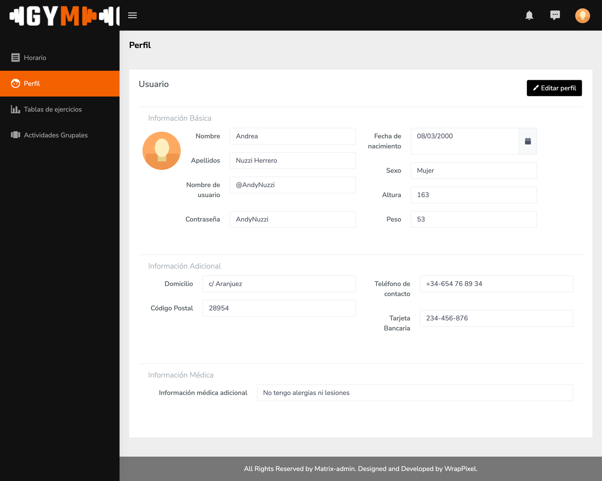

# RUKY GYMASTIC

The objective of this application is to represent a gym. It will allow users to store important information related to activities carried out in the gym.

___

## MEMBERS OF THE TEAM

| Name | Corporative email | Github user |
| - | - | - |
| Carlos Fernández López | c.fernandezl.2019@alumnos.urjc.es | ruky00 |
| Néstor Granado Pérez | n.granado.2019@alumnos.urjc.es | nestorgranado |
| Alessandro Nuzzi Herrero | a.nuzzi.2019@alumnos.urjc.es | AlessandroNuzziURJC |
| Andrea Nuzzi Herrero | a.nuzzi.2018@alumnos.urjc.es | AndyNuzzi |
| Fernando Sarabia Rodríguez | f.sarabia.2019@alumnos.urjc.es | f.sarabia |

___

## CORPORATIVE TOOLS

In order to plan the distribution of work, the team is going to use trello, (https://trello.com/b/u60sMfLS/g3-daw-2021-22). If online meetings are necessary, the team will use Discord.

___

## PHASE 0: APLICATION FUNCTIONALITIES

### ENTITIES

There are going to be four different entities:
* **USER** —  This entity represents the application's users. There are different types of users that take part in the system:
  * Gym Member
  * Gym Instructor
  * Administrator 
*  **EXERCISE** — This entity represents a physical activity a gym member can perform. The member can be guided by an instructor or not.
*  **GROUP ACTIVITIES** — This entity represents a sport which is directed by instructors. Group activities can be created, modified or deleted by the administrator.
*   **EXERCISE TABLES** — This entity is formed by different types of exercises. The exercise tables are for gym members. Exercise tables can be created, modified or deleted by gym instructors.
  
### USERS

Among the user entity there are going to be different types of users:
* **Member** — is the type of user that have access to the different services provided by the gym.
* **Instructor** — this type of user can assign exercise tables to members and book rooms to perform group activities.
* **Administrator** — its main activity is to create and maintain updated the gym information.
* **Unregistered user** — this type of user can only access to information about the different prices and services provided by the gym.

### USER PERMISSIONS

Members and Instructors own the information they have in their profile. They can edit, create, modify and delete the information:
* Profile avatar
* Email
* Password
* Change of password
* Percentage of corporal fat
* Height
* Breadth
* Gender
* Bank account associated

Permissions associated to the administrator are: 
* Register new group activities, modify the existing ones and delete activities.
* Register new instructors, edit the instructors that form part of the gym and delete instructors.
* See the general progress of the gym members.

### IMAGES

Members and instructors will have representative avatars. They can modify it.
Administrators can edit images associated to the different entities: activities, exercise tables, general information of the gym...

### GRAPHICS

The administrator is the one who has de capability of visualizing the different graphics. They are mainly related to member participation graphics:
* Activities (it will be shown as bar charts)
* Exercise Tables (it will be shown as bar charts)

### COMPLEMENTARY TECHNOLOGY

Introduce the localization of the gym using Google Maps.
Generate different pdfs with the exercise tables.

### ADVANCED CONSULTING ALGORITHM

At the end of a season, members will be able to see their individual progress.

___

## Phase 1: Layout of pages

In order to help clarifying the references to the amount of screens that conform the web application, the team has used some codes:
* USRADM_XX: Screens that are dedicated for the administrator.
* USRMEM_XX: Screens that are dedicated for the members of the gym.
* USRMON_XX: Screens that are dedicated for the monitors of the gym.
* USRNR_XX: Screens that are dedicated for the unregistered users.

### Screens

The application consists of the following screens:

* USRADM_01Statistics: This page shows the different statistics the administrator is able to see.
  
* USRADM_02ActivitiesList: This screen shows the different grupal activities that are registered in the system.
  
* USRADM_03MonitorsList: This screen contains a list of monitors that are working for the gym.
  
* USRADM_04AddActivity: This screen is a form. On it, you can add the information needed for creating a new activity.
  
* USRADM_05DeleteActivity: This screen shows all the activities and allows the administrator to select several activities to delete them.
  
* USRADM_06SeeActivityInfo: This screen shows the information of an activity.
  
* USRADM_07EditActivity: This screen allows the administrator to change the information of an specific activities.
  
* USRADM_08AddMonitor: This screen allows the admin to add a new monitor to the system.
  
* USRADM_09DeleteMonitor: This screen shows a table with monitors. The administrator can select them and delete them from the system.
  
* USRADM_10SeeMonitorInfo: This screen shows the information about an specific monitor.
  
* USRADM_11EditMonitor: The administrator can edit the amount of instructors the gym has. The administrator can add a new instructor or delete an existing instructor.
  
* USRADM_12EditMembers: The administrator can edit the amount of members the gym has. The administrator can add a new member or delete an existing member.
  
* USRMEM_01ExerciseTable: The user can see the different exercise tables associated by the instructor.
  
* USRMEM_02Profile: The member can see the information used in the register.
  
* USRMEM_03EditProfile: Members can edit their private information.
  
* USRMEM_03Statistics: User can see their progress along the season. This progress is going to be shown as different charts.
  
* USRMEM_04Activities: The member can see the activities they are subscribed.
  
* USRMON_01Schedule: This page shows monitor schedule.
  
* USRMON_02Profile: The monitor can see the information used in the register.
  
* USRMON_03ExerciseTable: This page shows the activities the monitor will teach.
  
* USRMON_04GrupalActivities: This page show the exercises tables the monitor uploads. Exercices tables can be uploaded and deleted.
  
* USRMON_05EditProfile: Monitors can edit their private information.
  
* USRMON_06AddExerciseTable: This screen allows the monitor to add a new exercise table to the system.
  
* USRMON_07DeleteExerciseTable: This screen shows a table with exercises tables. The monitor can select them and delete them from the system.
  
* USRNR_01GymMainPage: Main page that all users will see upon entering and briefly explains the gym's services.
  
* USRNR_02Schedule: This page shows the schedule of activities available in the gym.
  
* USRNR_03ContactUsGym: Page with contact information of the gym as well as a map with the location of the gym.
  
* USRNR_04PricesGym: This page shows the three possible rates you can choose to join the gym.
  
* USRNR_05activitiesGym: This page has two parts, one contains the individual activities offered by the gym and the other the group activities.
  
* USRNR_06SignInGym: Gym registration page.
  
* USRNR_07LogInGym: Page used by regsitrated users to enter to their account in the gym.
  

### Navigation diagram

The following diagram shows how users can navigate through the different pages of the application according to their role.
  

___
